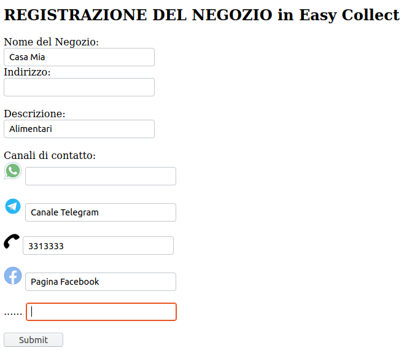
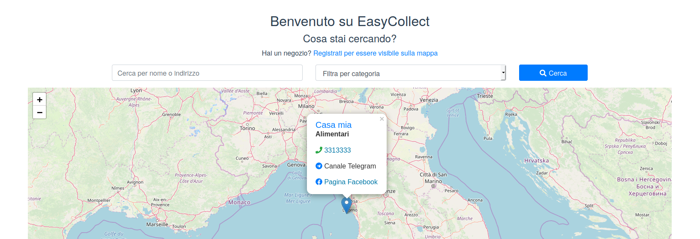
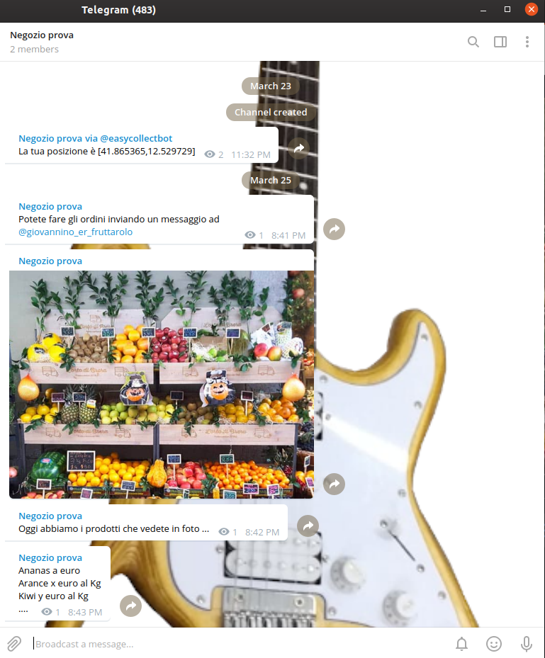
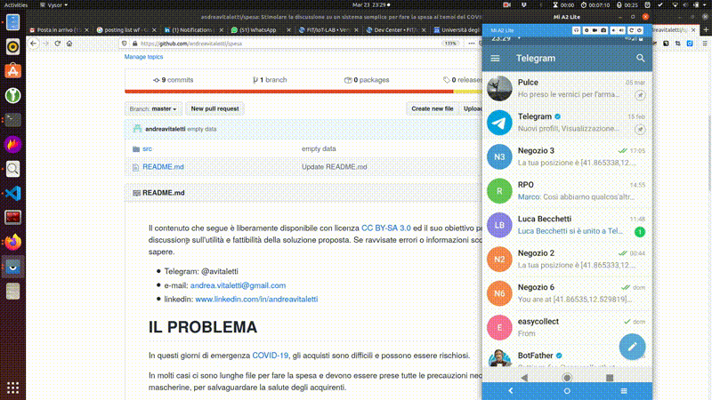

# EasyCollect: riduciamo la fila, aumentiamo la sicurezza

Il contenuto che segue è liberamente disponibile con licenza [CC BY-SA 3.0](https://creativecommons.org/licenses/by-sa/3.0/) ed il suo obiettivo primario è stimolare una discussione sull'utilità e fattibilità della soluzione proposta. Se ravvisate errori o informazioni scorrette vi prego di farmelo sapere. **Se siete sviluppatori o semplicemente volete contribuire, vi prego di [contattarci](#PERSONE), siamo già un bel [gruppo](#PERSONE).**

# SOMMARIO

**PROBLEMA.** In questa emergenza gli acquisti sono difficili e possono essere rischiosi a causa delle lunghe file che inducono alcuni ad approvigionamenti eccessivi. Le consegne a domicilio hanno forti ritardi e sono contingentate

**SOLUZIONE.** Easy Collect un processo semplice già sperimentato in alcuni contesti

1. L'utente accede ad un canale online per selezionare i prodotti
2. l'esercente confeziona i prodotti selezionati dall'utente
3. Il cliente si reca dall'esercente quando indicato al solo per ritirare i propri prodotti e pagare laddove non l'abbia già fatto online

**BENEFICI.**

1. I tempi necessari a ritirare i prodotti sono minimi: si riducono o azzerano le code
2. Gli approvigionamenti eccessivi possono essere limitati

**TARGET.** La GDO ha le risorse per realizzare soluzioni complesse, il target sono i negozi di quartiere e richiede la sola disponibilità di un cellulare con comuni app di messaggistica che hanno già dimostrato di sopportare carichi elevati.

# IL PROBLEMA

In questi giorni di emergenza [COVID-19](https://www.who.int/emergencies/diseases/novel-coronavirus-2019/advice-for-public), gli acquisti sono difficili e possono essere rischiosi. 

In molti casi ci sono lunghe file per fare la spesa e devono essere prese tutte le precauzioni necessarie, come guanti e mascherine, per salvaguardare la salute degli acquirenti.  

Ci sono sati casi in cui alcune persone, spaventate da possibili mancanze di approvigionamenti, hanno acquistato una quantità esagerata di prodotti. Sebbene la paventata mancanza di approvigionamenti non si sia manifestata, questo comportamento ha portato un disagio agli altri che sono stati costretti ad accontentarsi di quanto rimasto.  

Le piattaforme online, sottoposte al carico di questi giorni, prediligono giustamente la distribuzione dei prodotti ai soli utenti che ne hanno maggiormente bisogno (per esempio anziani, persone diversamente abili, future mamme o neo genitori, persone ammalate etc.) e comunque accumulano ritardi importanti (dell'ordine di giorni) per recapitare i prodotti a casa.

# UNA POSSIBILE SOLUZIONE

Per ovviare a questo problema, proponiamo un processo molto semplice, già sperimentato in alcuni contesti ... qualcuno direbbe "la scoperta dell'acqua calda!" :-) 

1. Un canale online (web, telegram, facebook etc) indicizza e rende possibile la ricerca dei negozi fornendo un **canale di comunicazioni con cui contattarli**
2. L'utente contatta il negozio sul canale di comunicazione specificato per selezionare i prodotti
3. l'esercente confeziona i prodotti selezionati dall'utente in modo che possano essere ritirati
4. Il cliente si reca dall'esercente semplicemente per ritirare i propri prodotti e eventualmente pagare laddove non l'abbia già fatto online 

Sono possibili molti miglioramenti come per esempio la possibilità che l'esercente  indichi l'intervallo di tempo in cui ritirare la spesa in modo da evitare possibili accodamenti

Questo processo, potrebbe portare ai seguqnti benefici:

1. I tempi necessari a ritirare i prodotti sono minimi e dunque si riducono, o addirittura azzerano le code, con evidente beneficio anche sulla sicurezza di acquirenti e lavoratori
2. Laddove necessario, il controllo sulla quantità di prodotti potrebbe esser applicato alla fonte, limitando l'accumulo non necessario da parte di pochi

# VINCOLI

**Il processo che proponiamo deve essere realizzato su un'infrastruttura minimale: il solo cellulare del negoziante**

# FUNZIONALITA' PRINCIPALI

Il processo prevede 3 funzionalità principali: 1) la registrazione del negozio, 2) La ricerca del negozio, 3) l'acquisto e il ritiro dei prodotti

## LA REGISTRAZIONE DEL NEGOZIO

Il **negoziante**, attraverso il proprio cellulare, registra il negozio fornendo le seguenti informazioni:

1. Nome del Negozio
2. Indirizzo e/o Coordinate Geografiche
3. Descrizione (es: Alimentari e norcineria)
4. Canali di contatto (es: telefono, Telegram, Messanger, Whatsup)

Queste informazioni sono immagazzinate nel back-end e forniscono la base di dati per la successiva fase di ricerca

La figura che segue mostra una possibile interfaccia Web, meccanismi analoghi dovrebbero essere realizzati su vari canali (es: Telegram, Messanger, App Android, App IoS etc)

## LA RICERCA DEL NEGOZIO

L'**acquirente** accede ad un servizio (Web, App Android o IoS, integrato nei canali di contatto) che fornisce le seguenti funzionalità:

1. Visualizzazione sulla mappa dei Negozi
2. Ricerca con chiave (Nome Negozio, Indirizzo di prossimità, Descrizione, Canale di contatto)

L'output della Visualizzazione e della ricerca con chiave sono le informazioni del negozio e cioè

1. Nome del Negozio
2. Indirizzo e/o Coordinate Geografiche
3. Categoria (max 3)
4. Descrizione (es: 144 caratteri stile twitter compreso eventual link al sito del negozio)
5. Canali di contatto (es: telefono, Telegram, Messanger, Whatsup)

La figura che segue mostra una possibile interfaccia Web, meccanismi analoghi dovrebbero essere realizzati su vari canali (es: Telegram, Messanger, App Android, App IoS etc)

## L'ACQUISTO e IL RITIRO DEI PRODOTTI 

Dopo avere effettuato la ricerca, l'acquirente ha tutte le informazioni necessari per contattare **autonomamente** il negozio sui **canali di contatto** forniti. 

**Le fasi successive di selezione dei prodotti, confezionamento, ritiro e pagamento vengono realizzate dal negoziante in piena autonomia interagendo con l'acquirente sul canale di contatto**

Un possibile esempio su Telegram facilmente adattabil a molti altri canali

A) Il Negoziante informa sul canale indicato nella ricerca come contattarlo privatamente (nell'esempio @giovannino_er_fruttarolo) e la merce disponibile con informazioni su prezzi e quantità

B) L'acquirente invia un messaggio privato al negoziante indicando i prodotti che desidera

C) Il negoziante conferma che prende in carico l'ordine rispondendo al messaggio

D) Quando l'ordine è pronto il negoziante informa l'acquirente indicando l'orario in cui effettuare il ritiro

E) L'acquirente ritira il prodotto nell'orario indicato, paga e torna a casa con la merce

# IL RUOLO DEI NEGOZI DI QUARTIERE

Nella soluzione delineata, i negozi di quartiere potrebbero ritornare ad avere un ruolo fondamentale di distribuzione dei prodotti vicino agli acquirenti. 

Sebbene non si possa assumere che un negozio di quartiere sia dotato di un sistema di e-commerce, si possono immaginare mille modi per implementare il processo. Di seguito ne descriviamo sommariamente alcuni. 

Invito chiunque ne abbia voglia a proporre alternative, possibilmente facendo un piccolo tutorial che spiega come adottare la soluzione proposta. 

Se qualcuno dovesse implementare una di queste soluzioni, vi prego di comunicarmelo in modo da condividerlo con tutti. 

## LA SOLUZIONE VIA TELEFONO (ALLA VECCHIA MANIERA)

1. Il cliente chiama il negoziante e si accorda per la spesa 
2. l'acquirente si reca presso il negozio, preleva la spesa e paga

## LA SOLUZIONE SU [TELEGRAM](https://telegram.org/)

1. Il negoziante apre un canale telegram 
2. Al mattino il negoziante fa un video sulla propria offerta o invia un messaggio sul canale descrivendo l'offerta
3. Gli acquirenti inviano un messaggio al negoziante con la lista della spesa
4. Il negoziante conferma la disponibilità e suggerisce un intervallo di tempo in cui prelevare la spesa
5. l'acquirente si reca presso il negozio preleva la spesa e paga

**Le app di messagistica hanno dimostrato di reggere a forti carichi e sono molto diffuse, sono dunque sulla carta una buona soluzione tecnologica**

## Un semplice Proof-of-concept

Ancora veramente minimale, ma dimostra il concetto. Il codice è disponibile su [src](https://github.com/andreavitaletti/spesa/tree/master/src)

# IL RUOLO DALLA GDO

La maggiorparte della GDO è già dotata di sistemi di e-commerce, ma come già osservato in questo momento il meccanismo di recapito della spesa nelle abitazioni degli acquirenti è congestionato. 

Non conosco a sufficienza i sistemi informatici della GDO per sapere quali siano le difficoltà nell'implementare il meccanismo proposto, ma immagino che con un po' di buona volontà si possa fare. 

Prego chiunque abbia informazioni più sostanziali di contattarmi

# Servizi per vedere le attese in fila

Sono già disponibili servizi molto utili che consentono fi visualizzare le attese in fila ai negozi, supermercati in particolare. Per esempio:

* https://dovefila.it/
* https://www.filaindiana.it/
* https://iorestoacasa.delivery/

**La differenza fondamentale rispetto alla nostra proposta è che in ogni caso la fila, sebbene ridotta, va comunque fatta per poter accedere alle successive fasi di selezione prodotti all'interno del negozio, pagamento e ritiro. Nel nostro caso, la merce è già pronta e deve solo essere ritirata e pagata.**

# PERSONE

Abbiamo un gruppo Telegram, unitevi su https://t.me/joinchat/JQE9dBW4OKvKDT7319uiQg 

* Andrea Vitaletti, vitaletti@diag.uniroma1.it, telegram @avitaletti, linkedin: www.linkedin.com/in/andreavitaletti, github andreavitaletti, ruolo: coordinamento progetto
* Luca Tomei, luca.tom1995@gmail.com, 3505613338, (@LucasMac Telegram),Github:LucaTomei ,  ruolo: Coordinatore GruppoTelegram e successivo sviuppo
* Daniele Iacomini,, 3347324519, telegram @daniele_iacomini github: DanieleIacomini ruolo: sviluppo bot telegram
* Simone Staffa, simonestaffa96@gmail.com, telegram @simonestaffa, github @simonestaffa, ruolo Coordinamento Backend e Frontend Web
* Luca Ferrera, luca.ferrera96@gmail.com, github Luca-Ferrera, ruolo coordinatore bot whatsapp e sviluppo
* Valerio Coretti, coretti.1635747@studenti.uniroma1.it, 3273431849, telegram @valeriocoretti, github: valecor95, ruolo: sviluppo bot Messenger
* Marco Zecchini, zecchini@diag.uniroma1.it, github @marcozecchini, ruolo: sviluppo bot Messenger
* Andrea Misuraca, and.misuraca@gmail.com, telegram: @amisuraca,Github: @andreamisu, Ruolo Frontend Dev
* Michele Anselmi, anselmi.1716741@studenti.uniroma1.it, telegram: @Mikyxello, github: Mikyxello, ruolo Backend Dev
* Simone Silvestri telegram: @simonesilvo, github: mrPsycox, ruolo: sys-admin + db
* Andrea Aurizi, andrea.aurizi@gmail.com, 3934500368, Telegram @AndreaAurizi; Github: andreaaurizi, ruolo: svilupo bot telegram
* Matteo Brandi info@investimentidigitali.it, ruolo:  supporto al backend Telegram: @m4tteobr4ndi 
* Davide Gimondo, davegimo@gmail.com, 348 7562451, telegram: @davegimo, github: /davegimo, ruolo: webapp developer & video tutorial

